# AI Drug Stability Intelligence System (ADSI)

## 🧠 Abstract

Maintaining pharmaceutical stability throughout distribution networks is essential for ensuring drug efficacy and patient safety.  

In tropical regions such as Nigeria, medicines are frequently exposed to elevated temperature and humidity conditions during transportation and storage, leading to degradation of active pharmaceutical ingredients (APIs).

This project presents the **AI Drug Stability Intelligence System (ADSI)** — a real-time monitoring and predictive analytics platform that integrates environmental sensing, machine learning, and intelligent alert systems to detect and prevent drug degradation in real-world supply chains.

---

## 🚨 Problem Statement

Drug supply chains in Africa face:

- Lack of real-time environmental monitoring  
- High exposure to heat and humidity  
- Weak regulatory visibility across locations  
- Increased risk of ineffective or unsafe medicines  

These challenges directly impact **public health outcomes**.

---

## 💡 Proposed Solution

ADSI introduces a **data-driven monitoring and decision system** that:

- Collects environmental data (temperature, humidity, time)
- Predicts degradation risk using machine learning
- Detects threshold breaches and compliance violations
- Generates alerts and escalation decisions
- Visualizes system state via an intelligent dashboard

---

## 🧠 System Architecture

Sensor → API → AI Model → Database → Dashboard → Alerts

### Architecture Diagram
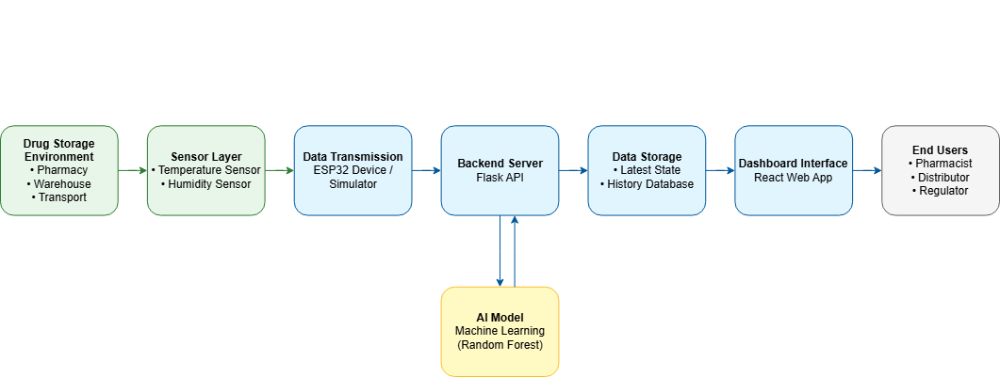

### AI Pipeline
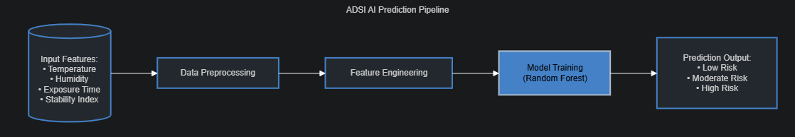

### Data Flow
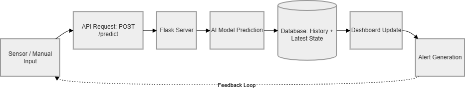

---

## 🔬 Methodology

### Dataset

A synthetic dataset was developed based on:

- Pharmaceutical stability guidelines  
- Environmental exposure modeling  
- Tropical storage conditions  

### Features

- drug_name  
- temperature_exposure  
- humidity  
- exposure_hours  
- stability_index  
- risk_label  

### Model

- Supervised machine learning (Scikit-learn)
- Classification output:
  - Low Risk
  - Moderate Risk
  - High Risk

---

## ⚙️ System Implementation

### Backend

- Flask API  
- Endpoint: `/predict`  
- Handles both sensor and manual inputs  

### Frontend

- React (Vite)  
- Tailwind CSS (Premium Twilight Healthcare UI)  
- Modular dashboard architecture  

### Simulation Layer

- Real-time sensor simulation  
- Continuous environmental data streaming  

---

## 📊 Results & Dashboard Output

### 🖥️ Full Dashboard Overview
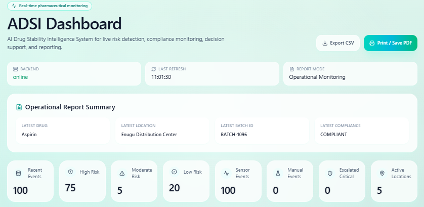

---

### 🔴 Manual Risk Prediction & Live Monitoring (Sensor Data)
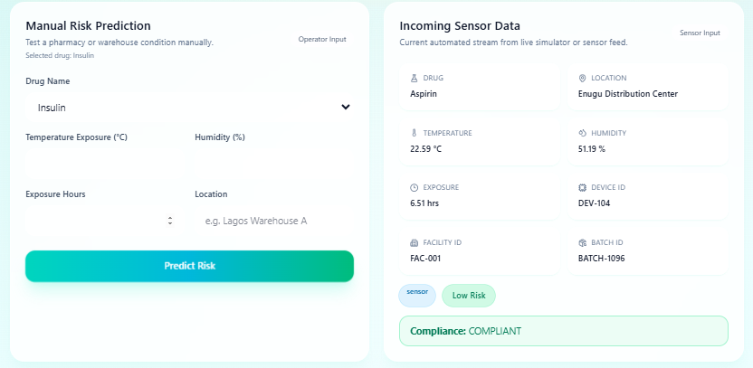

---

### 📡 Latest Live Monitoring Detail
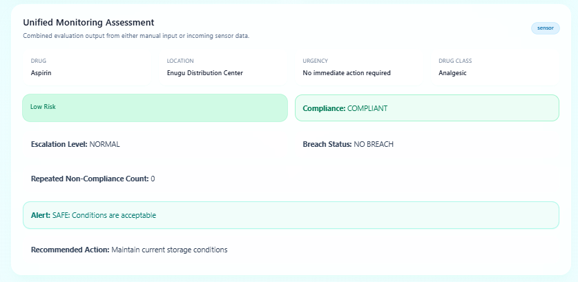

---

### 🚨 Alert Center
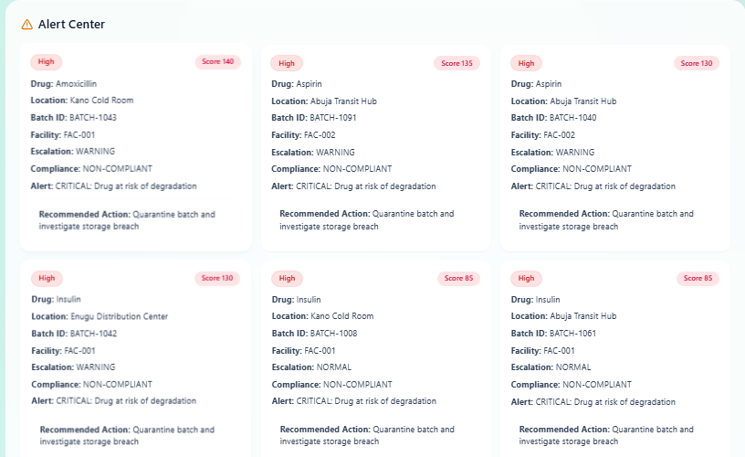

---

### 🌍 Location Risk Intelligence
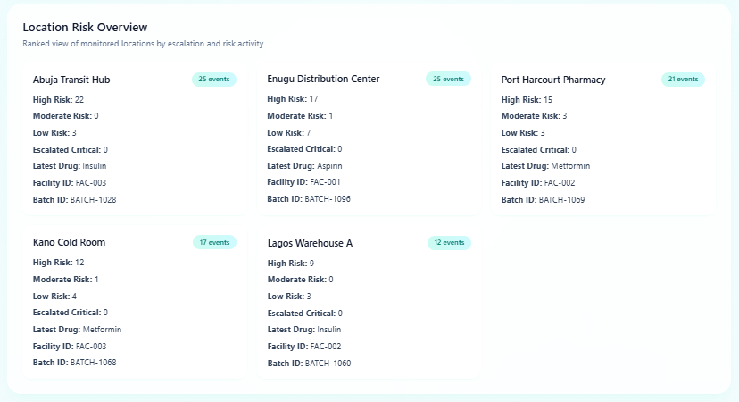

---

### 🧾 Inspection Priority Panel
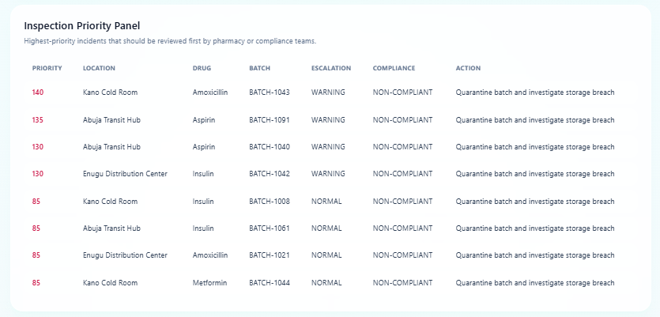

---

### 📈 Environmental Trends

#### Temperature & Humidity Charts
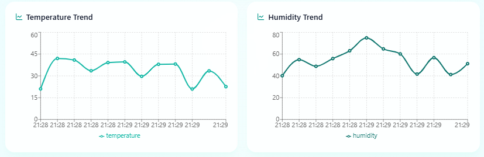

---

### 📊 Risk Distribution
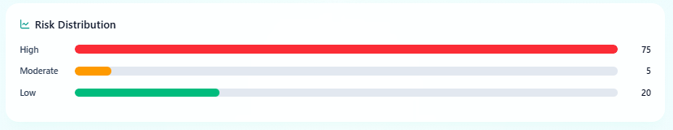

---

### 📜 Monitoring History
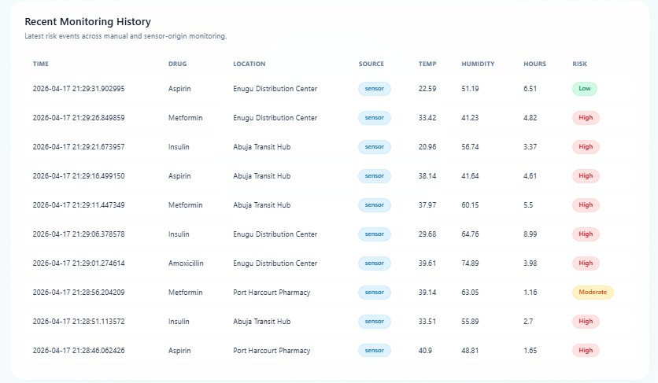

---

### 💊 Drug Activity Summary
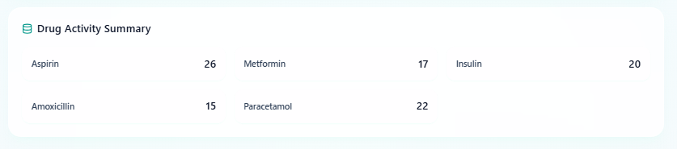

---

## 🧠 Intelligent Features

- Threshold breach detection  
- Repeated non-compliance tracking  
- Escalation logic (NORMAL → WARNING → CRITICAL)  
- Priority scoring for inspection  
- Real-time alert generation  

---

## 🌍 Real-World Application

ADSI can be deployed in:

- Pharmacies  
- Drug warehouses  
- Distribution chains  
- Regulatory bodies (e.g., NAFDAC)  

### Deployment Flow

Sensor → Cloud API → AI Model → Dashboard → Regulatory Action

---

## 🏆 Novelty & Contribution

Unlike existing systems, ADSI:

- Combines **AI prediction + IoT monitoring**
- Introduces **escalation intelligence**
- Supports **multi-location risk tracking**
- Enables **decision-based alerts**, not just monitoring

---

## 📈 Impact

- Reduces distribution of degraded drugs  
- Improves patient safety  
- Strengthens regulatory oversight  
- Enables proactive intervention  

---

## 🔮 Future Work

- Real IoT hardware deployment  
- Cloud database integration (MongoDB / Firebase)  
- Mobile monitoring application  
- GPS-based logistics tracking  
- Integration with national drug regulatory systems  

---

## ⚙️ Technologies

**Hardware:** ESP32 + DHT22  
**Backend:** Flask (Python)  
**AI:** Scikit-learn  
**Frontend:** React (Vite) + Tailwind CSS  
**Database:** JSON (extendable to MongoDB)  

---

## 👤 Author

Haruna Ademoye  
AI/ML Engineer | Pharmaceutical Technology  